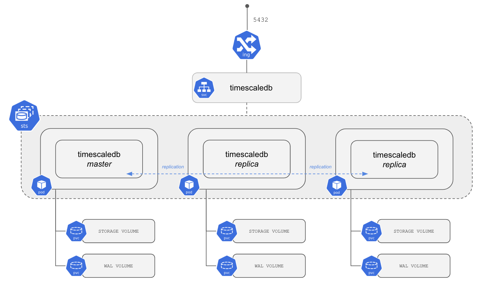
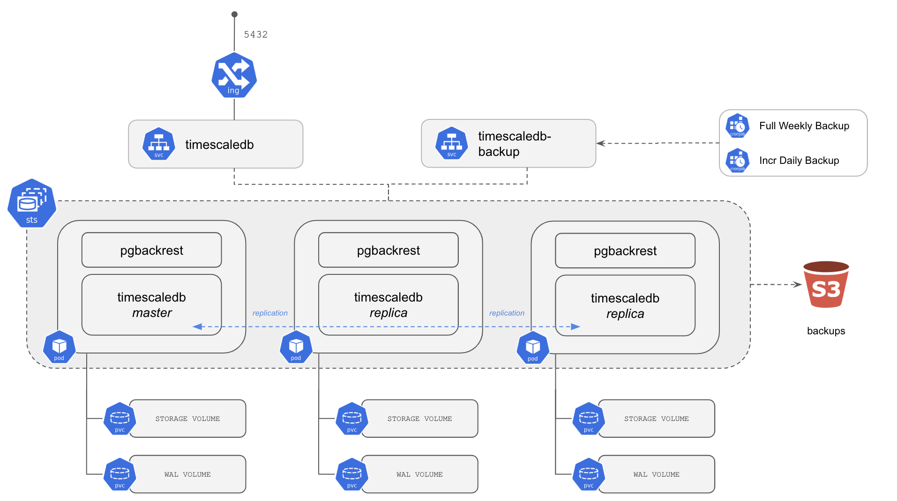

<!---
This file and its contents are licensed under the Apache License 2.0.
Please see the included NOTICE for copyright information and LICENSE for a copy of the license.
-->

# TimescaleDB Single

This helm chart was customization by Poseidom Team.

This directory contains a Helm chart to deploy a three
node [TimescaleDB](https://github.com/timescale/timescaledb/) cluster in a
High Availability (HA) configuration on Kubernetes. This chart will do the following:

- Creates three (by default) pods using a Kubernetes [StatefulSet](https://kubernetes.io/docs/concepts/workloads/controllers/statefulset/).
- Each pod has a container created using the [TimescaleDB Docker image](https://github.com/timescale/timescaledb-docker-ha).
  - TimescaleDB 1.6 and PG 11
- Each of the containers runs a TimescaleDB instance and [Patroni](https://patroni.readthedocs.io/en/latest/) agent.
- Each TimescaleDB instance is configured for replication (1 Master + 2 Replicas).



When deploying on AWS EKS:
- The pods will be scheduled on nodes which run in different Availability Zones (AZs).
- An AWS Elastic Load Balancer (ELB) is configured to handle routing incoming traffic to the Master pod.

When configured for Backups to S3:
- Each pod will also include a container running [pgBackRest](https://pgbackrest.org/).
- By default, two [CronJobs](https://kubernetes.io/docs/concepts/workloads/controllers/cron-jobs/) are created to handle full weekly and incremental daily backups.
- The backups are stored to an S3 bucket.



## Parameters
The following table lists the configurable parameters of the TimescaleDB Helm chart and their default values.

### - Simple create service parameters

|       Parameter                   |           Description                       |                         Default                     |
|-----------------------------------|---------------------------------------------|-----------------------------------------------------|
| `global.imageRegistry`            | Global Docker image registry                | By Poseidon Service Setting                         |
| `credentials.postgres`            | Set password for postgres                   | `postgres`                                          |
| `credentials.admin`               | Set password for admin                      | `admin`                                             |

### - Other parameters

|       Parameter                   |           Description                       |                         Default                     |
|-----------------------------------|---------------------------------------------|-----------------------------------------------------|
| `nameOverride`                    | Override the name of the chart              | `timescaledb`                                       |
| `clusterName`                     | Override the name of the PostgreSQL cluster | Equal to the Helm release name                      |
| `fullnameOverride`                | Override the fullname of the chart          | `nil`                                               |
| `replicaCount`                    | Amount of pods to spawn                     | `3`                                                 |
| `image.repository`                | The image to pull                           | `timescaledev/timescaledb-ha`                       |
| `image.tag`                       | The version of the image to pull            | `pg11-ts1.6`                                        |
| `image.pullPolicy`                | The pull policy                             | `IfNotPresent`                                      |
| `tls.cert`                        | The public key of the SSL certificate for PostgreSQL | empty (a self-signed certificate will be generated) |
| `tls.key`                         | The private key of the SSL Certificate for PostgreSQL | empty                                     |
| `backup.enabled`                  | Schedule backups to occur                   | `false`                                             |
| `backup.pgBackRest`               | [pgBackRest configuration](https://github.com/timescale/timescaledb-kubernetes/blob/master/charts/timescaledb-single/values.yaml)     | Working defaults |
| `backup.jobs`                     | A list of backup schedules and types        | 1 full weekly backup, 1 incremental daily backup    |
| `env`                             | Extra custom environment variables, expressed as [EnvVar](https://kubernetes.io/docs/reference/generated/kubernetes-api/v1.16/#envvarsource-v1-core)          | `[]`                                                |
| `patroni`                         | Specify your specific [Patroni Configuration](https://patroni.readthedocs.io/en/latest/SETTINGS.html) | A full Patroni configuration |
| `callbacks.configMap`             | A kubernetes ConfigMap containing [Patroni callbacks](#callbacks) | `nil`                         |
| `resources`                       | Any resources you wish to assign to the pod | `{}`                                                |
| `nodeSelector`                    | Node label to use for scheduling            | `{}`                                                |
| `tolerations`                     | List of node taints to tolerate             | `[]`                                                |
| `affinityTemplate`                | A template string to use to generate the affinity settings | Anti-affinity preferred on hostname and (availability) zone |
| `affinity`                        | Affinity settings. Overrides `affinityTemplate` if set. | `{}`                                    |
| `schedulerName`                   | Alternate scheduler name                    | `nil`                                               |
| `loadBalancer.enabled`            | If enabled, creates a LB for the primary    | `true`                                              |
| `loadBalancer.annotations`        | Pass on annotations to the Load Balancer    | An AWS ELB annotation to increase the idle timeout  |
| `networkPolicy.enabled`           | If enabled, creates a NetworkPolicy for controlling network access | `false`
| `networkPolicy.ingress`           | A list of Ingress rules to extend the base NetworkPolicy | `nil`
| `networkPolicy.prometheusApp`     | Name of Prometheus app to allow it to scrape exporters | `prometheus`
| `replicaLoadBalancer.enabled`     | If enabled, creates a LB for replica's only | `false`                                             |
| `replicaLoadBalancer.annotations` | Pass on annotations to the Load Balancer    | An AWS ELB annotation to increase the idle timeout  |
| `prometheus.enabled`              | If enabled, run a [postgres\_exporter](https://github.com/wrouesnel/postgres_exporter) sidecar | `false` |
| `prometheus.image.repository`     | The postgres\_exporter docker repo          | `wrouesnel/postgres_exporter`                       |
| `prometheus.image.tag`            | The tag of the postgres\_exporter image     | `v0.7.0`                                            |
| `prometheus.image.pullPolicy`     | The pull policy for the postgres\_exporter  | `IfNotPresent`                                      |
| `persistentVolumes.data.enabled`  | If enabled, use a Persistent Data Volume    | `true`                                              |
| `persistentVolumes.data.mountPath`| Persistent Data Volume mount root path      | `/var/lib/postgresql/`                              |
| `persistentVolumes.wal.enabled`   | If enabled, use a Persistent Wal Volume. If disabled, WAL will be on the Data Volume | `true`     |
| `persistentVolumes.wal.mountPath` | Persistent Wal Volume mount root path       | `/var/lib/postgresql/wal/`                          |
| `persistentVolumes.<name>.accessModes` | Persistent Volume access modes         | `[ReadWriteOnce]`                                   |
| `persistentVolumes.<name>.annotations` | Annotations for Persistent Volume Claim| `{}`                                                |
| `persistentVolumes.<name>.size`   | Persistent Volume size                      | `2Gi`                                               |
| `persistentVolumes.<name>.storageClass`| Persistent Volume Storage Class        | `volume.alpha.kubernetes.io/storage-class: default` |
| `persistentVolumes.<name>.subPath`| Subdirectory of Persistent Volume to mount  | `""`                                                |
| `persistentVolumes.tablespaces`   | A mapping of tablespaces and Volumes        | `nil`, see [multiple-tablespaces.yaml](values/multiple-tablespaces.yaml) for a full example |
| `rbac.create`                     | Create required role and rolebindings       | `true`                                              |
| `serviceAccount.create`           | If true, create a new service account       | `true`                                              |
| `serviceAccount.name`             | Service account to be used. If not set and `serviceAccount.create` is `true`, a name is generated using the fullname template | `nil` |
| `timescaledbTune.enabled`         | If true, runs `timescaledb-tune` before starting PostgreSQL | `false`                             |

## Connecting to TimescaleDBs

To connect to the TimescaleDB instance, we first need to know to which host we need to connect. Use `kubectl` to get that information:
```console
kubectl get service/my-release
```
```
NAME         TYPE           CLUSTER-IP       EXTERNAL-IP                 PORT(S)          AGE
my-release   LoadBalancer   10.100.149.189    verylongname.example.com   5432:31294/TCP   27s
```

Using the External IP for the service (which will route through the LoadBalancer to the Master), you
can connect via `psql` using the following (default example superuser password is `tea`)

> NOTICE: You may have to wait a few minutes before you can resolve the DNS record

```console
psql -h verylongname.example.com -U postgres
```
```
Password for user postgres:
postgres=#
```

From here, you can start creating users and databases, for example, using the above `psql` session:
```sql
CREATE USER example WITH PASSWORD 'thisIsInsecure';
CREATE DATABASE example OWNER example;
```

Connect to the example database with the example user:

```console
psql -h verylongname.example.com -U example -d example
```

This should get you into the example database, from here on you can follow
our [TimescaleDB > Getting Started](https://docs.timescale.com/latest/getting-started/creating-hypertables) to create hypertables
and start using TimescaleDB.

### Connecting from inside the Cluster

To access the database from inside the cluster, you can run `psql` inside the Pod containing the primary:

```
RELEASE=my-release
kubectl exec -ti $(kubectl get pod -o name -l role=master,release=$RELEASE) psql
```

## Create backups to S3
The backup is disabled by default, look at the
[Administrator Guide](admin-guide.md#backups) on how to configure backup location, credentials, schedules, etc.

## Further reading

- [Administrator Guide](admin-guide.md)
- [TimescaleDB Documentation](https://docs.timescale.com/latest/main)
